# Research Report: Graph Engineering, Context Management & Deterministic Agent Orchestration

**Author:** Antigravity CLI  
**Date:** 2026-09-01  
**Project:** `maestro` (`docs/RESEARCH_GRAPH_ORCHESTRATION_AND_MEMORY.md`)  
**Context:** Research initiative addressing `docs/DESIGN.md` §14 (*"Graph engineering for agent orchestration"*).  
**Source Material:** Extracted transcripts, metadata, and artifacts from 10 technical reels by Kem Tossoun ([`@kem_glitch`](https://www.instagram.com/kem_glitch/)), co-founder of Glitch Cat Club and former global data management director at UBS, processed via the `instagram-to-value` ASR pipeline.

---

## 1. Executive Summary & Problem Context

In `docs/DESIGN.md` §14, Maestro flags a critical future research vector:
> *"Graph engineering for agent orchestration. The current frontier beyond 'prompt engineering' and 'loop engineering' in agentic coding is structuring agent work as an explicit graph (nodes = agent calls/tools/checks, edges = control/data flow and conditional branching) rather than a single supervised loop... Run a deep-research session to survey state-of-the-art graph-based agent orchestration... for ideas that could improve maestro's own model."*

This report analyzes the technical corpus of **Kem Tossoun (`@kem_glitch`)**, who synthesizes 15+ years of institutional data architecture (e.g. at UBS) with cutting-edge agentic engineering in Claude Code / OpenAI environments.

### Core Takeaways for Maestro

1. **"Vibe Graphs" vs. Real Graph Engineering:**  
   Superficial "knowledge graphs" (auto-generating YAML frontmatter with LLMs, dumping notes in Obsidian, linking files via fuzzy keyword grep) are an anti-pattern. They inflate context windows, induce schema drift, and degrade into probabilistic guessing. True graph engineering requires **formal ontological modeling** and **deterministic multi-hop traversal tooling** that resolves dependencies in milliseconds *outside* the LLM.
2. **Hook Engineering > Prompt/Loop Engineering:**  
   Prompt-based instructions ("remember to do X", large system preambles, `CLAUDE.md` bloat) inevitably fail due to **context rot** and attention degradation (the *Attention Sinks* phenomenon). Deterministic orchestration is achieved at **four intercept hooks**: `prompt_submit`, `pre_tool_use`, `post_tool_use`, and `stop`.
3. **Deterministic Quality Gates (The 26-Gate Rule):**  
   "A passing test, a clean review, a design that reads fine are just claims." Autonomous loops require deterministic, binary code and AST linters that verify code structure and invariants before merges.
4. **Reverse-Indexed Grounded Memory (The Cerebras Pattern):**  
   Standard vector RAG fails because query semantics do not match target prose. Memory architectures should index **pre-generated retrieval questions** mapped to atomic facts, strictly enforced with **word-for-word exact quotes** from verified artifacts, coupled with automated session-close digests.

```mermaid
graph TD
    subgraph "Naive Agentic Loop (Probabilistic & Fragile)"
        A1[User / Orchestrator] -->|Large System Prompt + Preamble| B1[LLM Agent]
        B1 -->|Fuzzy Grep / Unstructured Reading| C1[Workspace & Markdown Files]
        C1 -->|Inflated Context & Rot| B1
        B1 -->|Probabilistic Claims 'Looks Green'| D1[Unvalidated Merge]
    end

    subgraph "Kem Tossoun / Maestro Graph Architecture (Deterministic & Resilient)"
        A2[Task DAG / Roadmap] -->|Multi-Hop Graph Resolver <2ms| B2[Minimal Subgraph Context]
        B2 -->|prompt_submit Hook: Dynamic Invariant Injection| C2[Implementer Agent]
        C2 -->|pre_tool_use Hook: Sandbox & Confinement Gate| D2[Tool Execution in Worktree]
        D2 -->|post_tool_use Hook: Deterministic Linter & Error Feedback| C2
        C2 -->|stop Hook: 26-Gate Pipeline & Result Sentinel| E2[Merge Gate]
        E2 -->|Exact-Quote Session Digest| F2[Central Memory Index]
    end
```



---

## 2. Deep-Dive Analysis of Core Themes

### 2.1. Graph Engineering: Ontological Rigor vs. "Vibe Graphs" (Reels `DcEBQNPNPzs`, `DcHG2kPtZZG`, `DcYcP6Jt1Dt`, `DcVk6x1tdY-`)

#### The Problem with Superficial Knowledge Graphs
A popular trend in agent tooling (Graphify, Obsidian wiki graphs, Karpathy-inspired auto-linking) advocates having LLMs synthesize loose YAML metadata across files and using keyword grep to jump between nodes.
* **Why it fails at scale:**
  * **Context Explosion:** When an agent traverses nodes by reading entire files or unconstrained YAML headers, it consumes tens of thousands of tokens per hop.
  * **Schema Drift:** Without a strict schema or database engine, the semantics of relations mutate across sessions.
  * **Grep Inadequacy:** Grep only finds single-document matches. Real engineering logic spans multi-document relational chains (e.g. *Feature Requirement* $\to$ *Adapter Interface* $\to$ *Worktree Sandbox* $\to$ *Gate Constraints* $\to$ *Merge Sentinel*).

#### The Proper Graph Solution
* **Formal Modeling:** Explicit entities (Tasks, Modules, Adapters, Gates, Invariants) with typed directed edges (PrerequisiteOf, Modifies, ConstrainedBy, VerifiedBy).
* **Deterministic Multi-Hop Traversal:** Traversal is executed by a fast, deterministic engine (e.g. NetworkX, SQLite/relational joins, or Cypher-like queries) in **under 2 milliseconds**, returning only the exact slice of metadata needed.
* **Zero-Token Prompt Injection:** Only the resolved subgraph is injected into the agent's turn. The agent does not read intermediate files to discover relations; the graph engine resolves the path beforehand.

---

### 2.2. The 4-Hook Interception Architecture (Reels `DcimG9JtYGp`, `DcOCgBkNNjK`)

The fundamental execution loop of any agent interaction is:
$$\text{Input} \longrightarrow \text{Model} \longrightarrow \text{Tool Invocation} \longrightarrow \text{Tool Output} \longrightarrow \text{Model} \longrightarrow \text{Termination}$$

Rather than attempting to govern agents by modifying static preambles or issuing conversational warnings, governance must be enforced through **deterministic intercept hooks**:

| Hook Point | Architectural Role | Practical Implementation |
|---|---|---|
| **1. `prompt_submit`** | Input classification, routing, and context injection. | Intercepts incoming task brief. Classifies complexity/horizon; performs multi-hop graph retrieval; dynamically injects current constraints and active linters. Routes long-horizon tasks to isolated sub-agents. |
| **2. `pre_tool_use`** | Hard security boundaries, sandbox confinement, argument linting. | Inspects tool commands (e.g., bash, file writes) *before* execution. Enforces worktree isolation, checks path deny-lists (protecting external repositories and out-of-sandbox paths), blocks privileged commands (`sudo`). Halts or denies without model round-trip. |
| **3. `post_tool_use`** | Output sanitization, error detection, deterministic self-correction. | Scans tool stdout/stderr. Truncates massive outputs; catches test failure patterns; injects deterministic lint feedback into the subsequent turn. |
| **4. `stop` / `session_close`** | Session completion verification, memory crystallization, task graduation. | Triggers when the agent attempts to stop. Verifies `result.json` and sentinel criteria; runs the 26-gate verification suite; extracts exact-quote memory digests into the project journal. |

---

### 2.3. Context Rot & Closed-Loop Linter Feedback (Reel `DclKZARteCP`)

#### The Mechanism of Context Rot
As an agent session accumulates turns and tool outputs, the model's attention to initial system instructions degrades significantly (the *Attention Sinks* phenomenon, Zhao et al.).
* Relying on `CLAUDE.md`, system prompts, or static preambles results in progressive rule violation as context exceeds 50K–100K tokens.
* Manual "skills" fail because the agent must remember to invoke them probabilistically.

#### Closed-Loop Linter Feedback
To achieve persistent compliance (e.g. Standard Technical English, concise handoffs, invariant adherence):
1. **Dynamic Prompt Injection (`prompt_submit`):** The engine injects active rules on each turn.
2. **Automated Response Linter (`post_tool_use` / `post_response`):** An external deterministic parser evaluates the agent's output against defined constraints (token count, schema conformance, disallowed patterns).
3. **Feedback Injection:** Any violations are fed into the immediate next turn prompt as a concrete correction directive, creating an automated self-correcting feedback loop.

---

### 2.4. Deterministic Quality Gates: The 26-Gate Principle (Reel `Dbk11QVtZB8`)

Kem emphasizes that in autonomous coding systems, "the code it writes isn't the problem — it's the code it writes that *looks* right."
* Tests can pass accidentally (e.g. mock tautologies, empty test assertions).
* Reviews can look clean while violating architecture invariants.
* **The Solution:** A deterministic suite of automated gates:
  1. AST parsing and static analysis (ensuring no unauthorized imports, forbidden APIs, or cyclic dependencies).
  2. Cyclomatic complexity and line-count caps on newly authored functions.
  3. Purity validation (ensuring generic modules contain no target-specific state or credentials).
  4. Non-flaky test execution across multiple parallel runs.
  5. Invariant hash checks across protected files.

---

### 2.5. Reverse-Indexed Grounded Memory & Automated Session Digests (Reel `DcqtyTStpsw`)

#### The Cerebras RAG Pattern
Conventional semantic search vectors paragraphs of code or documentation and compares them to user queries. This often fails because queries are syntactically and semantically distinct from implementation code.
* **Question Reverse-Indexing:** When indexing a module, doc, or decision, an LLM generates the top 5–10 specific engineering questions that this asset answers. The vector store indexes these *questions*.
* **Exact-Quote Verification:** Every stored memory fact must contain an exact, verbatim quotation from the source file. If the quote cannot be matched character-for-character against disk, the memory entry is rejected.
* **Automated Session Digest:** When an agent completes a task and triggers the `stop` hook:
  1. A lightweight process extracts the session transcript.
  2. Noise, tool outputs, and conversational filler are stripped.
  3. Structured state changes, exact-quote diffs, and updated dependencies are written to the central journal (`journal.ndjson`) and roadmap.

---

## 3. Comparative Architecture: Maestro Today vs. Graph & Hook Model

| Architectural Dimension | Maestro Current Baseline (`docs/DESIGN.md`) | Proposed Graph & Hook Architecture |
|---|---|---|
| **Orchestrator Topology** | Single linear event loop (`orchestrator.py`), sequential task execution, polling `result.json`. | **Explicit Task DAG & State Graph**: Tasks modeled as nodes with typed edge dependencies; concurrent multi-agent branches resolved via topological sort. |
| **Context Management** | Handoff via markdown brief files at 120K context ceiling; full file reading forbidden to orchestrator. | **Multi-Hop Subgraph Injection**: Orchestrator queries dependency graph for minimal required context slice ($<2\text{ms}$); dynamic rule injection via `prompt_submit` hook. |
| **Invariant Enforcement** | Procedural checks in `merge.py`, `confinement.py`, and post-stage manual verification commands. | **4-Hook Interception Pipeline**: `pre_tool_use` traps forbidden operations (e.g. out-of-worktree writes, unpermitted file modifications, `sudo`) before execution; `post_tool_use` lints output. |
| **Quality & Gate Verification** | Gate chain in `gates.py` (test $\to$ eval $\to$ smoke $\to$ latency). Optional eval gate. | **26-Gate Deterministic Pipeline**: AST structural checks, purity hashing, complexity bounds, and automated linter feedback loops. |
| **Task Memory & Roadmapping** | Linear markdown files (`ROADMAP.md`, `UPCOMING.md`, `PROGRESS.md`) parsed via regex. | **Reverse-Indexed Graph Store**: Entities and tasks indexed with question-based reverse mapping and exact-quote grounding. |

---

## 4. Actionable Design Proposals for Maestro

Based on this research, four concrete architectural enhancements are recommended for Maestro:

### Proposal A: Graph-Engineered Task DAG (`maestro/docs/depgraph.py`)

Replace regex-based linear roadmap parsing with a lightweight, in-memory directed acyclic graph (DAG) engine.

```python
# Conceptual Architecture for Maestro Task Graph
class TaskNode:
    task_id: str
    stage: str
    role: str
    target_modules: list[str]
    required_gates: list[str]
    invariants: list[str]

class TaskDAG:
    nodes: dict[str, TaskNode]
    edges: list[tuple[str, str, str]]  # (source, target, relation_type)

    def resolve_runnable_tasks(self, completed_tasks: set[str]) -> list[TaskNode]:
        """Deterministic multi-hop traversal to identify tasks with all dependencies satisfied."""
        ...

    def extract_task_subgraph(self, task_id: str) -> dict:
        """Returns the minimal structural context (dependencies, modified modules, active gates)
        in <2ms for prompt injection."""
        ...
```

### Proposal B: Deterministic 4-Hook Interceptor Framework (`maestro/hooks/`)

Integrate active hook scripts directly into backend adapter executions (`maestro/backends/claude.py`, `maestro/backends/codex.py`):

1. `hooks/prompt_submit.sh`: Queries `depgraph.py` for the current task's minimal context slice; appends concise invariant rules.
2. `hooks/pre_tool_use.sh`: Inspects all tool calls. Enforces worktree path confinement, blocks execution of dangerous bash commands, and verifies that protected files and external project directories are never targeted for writes.
3. `hooks/post_tool_use.sh`: Runs output linter; captures and truncates massive logs to prevent context blowout.
4. `hooks/stop.sh`: Verifies that `result.json` contains valid exit codes and required test receipts before allowing the implementer process to terminate.

### Proposal C: Self-Correcting Linter Feedback Loop

When an implementer agent generates code or reports task completion:
* Run deterministic AST checks (e.g. `flake8`, `mypy`, `test_purity.py`).
* If a check fails, automatically feed the exact line violation and rule definition into the next agent turn via standard input rather than failing the entire orchestrator stage.

### Proposal D: Automated Exact-Quote Session Digest (`maestro/docs/digest.py`)

At task completion boundaries:
* Parse the implementer's execution journal.
* Extract all code modifications and map them to explicit git commit SHAs and line ranges.
* Require that all progress updates in `docs/PROGRESS.md` include exact line-range quotes, preventing unverified assertions from corrupting the project state.

---

## 5. Primary Source Catalog & Reel Transcripts

The table below catalogs the 10 reels from `@kem_glitch` analyzed for this report, processed via `yt-dlp` and `groq-whisper-large-v3` in `instagram-to-value`:

| Shortcode | Date | Title / Description Summary | Primary Theme |
|---|---|---|---|
| [`Dbk11QVtZB8`](file:///home/dan/projects/instagram-to-value/media/Dbk11QVtZB8/Dbk11QVtZB8.16k.wav) | 2026-08-03 | *Less AI slop - more confident iteration - 26 gates you can implement today!* | Deterministic quality gates vs. probabilistic claims. |
| [`DcEBQNPNPzs`](file:///home/dan/projects/instagram-to-value/media/DcEBQNPNPzs/DcEBQNPNPzs.16k.wav) | 2026-08-15 | *Graph is not obsidian and graphify. That’s a mess!* | Critique of superficial knowledge graphs; requirement for formal ontological modeling. |
| [`DcHG2kPtZZG`](file:///home/dan/projects/instagram-to-value/media/DcHG2kPtZZG/DcHG2kPtZZG.16k.wav) | 2026-08-16 | *How to implement real knowledge graph (Tier 1 Architecture).* | Deterministic multi-hop traversal vs. LLM token waste. |
| [`DcimG9JtYGp`](file:///home/dan/projects/instagram-to-value/media/DcimG9JtYGp/DcimG9JtYGp.16k.wav) | 2026-08-27 | *Go deep not wide! The 4-hook agent loop.* | Intercept hooks (`prompt_submit`, `pre_tool_use`, `post_tool_use`, `stop`) vs. system prompt bloat. |
| [`DclKZARteCP`](file:///home/dan/projects/instagram-to-value/media/DclKZARteCP/DclKZARteCP.16k.wav) | 2026-08-28 | *Implement STE (Standard Technical English) & avoid context rot.* | Context rot, Attention Sinks, and 2-hook closed-loop feedback linters. |
| [`DcLR_gBNh0w`](file:///home/dan/projects/instagram-to-value/media/DcLR_gBNh0w/DcLR_gBNh0w.16k.wav) | 2026-08-18 | *Secret non-gate kept society / Broadcast channel launch.* | Community knowledge dissemination and artifact distribution. |
| [`DcOCgBkNNjK`](file:///home/dan/projects/instagram-to-value/media/DcOCgBkNNjK/DcOCgBkNNjK.16k.wav) | 2026-08-19 | *Design pattern for autonomous decision trees & routing.* | `prompt_submit` hook classification and routing to sandboxed sub-agents. |
| [`DcqtyTStpsw`](file:///home/dan/projects/instagram-to-value/media/DcqtyTStpsw/DcqtyTStpsw.16k.wav) | 2026-08-30 | *Free Cerebras RAG system & autonomous session digest.* | Question reverse-indexing, exact-quote grounding, and session close compaction. |
| [`DcVk6x1tdY-`](file:///home/dan/projects/instagram-to-value/media/DcVk6x1tdY-/DcVk6x1tdY-.16k.wav) | 2026-08-22 | *Ontology matters / Followers vs Friends.* | Ontological precision in system and data modeling. |
| [`DcYcP6Jt1Dt`](file:///home/dan/projects/instagram-to-value/media/DcYcP6Jt1Dt/DcYcP6Jt1Dt.16k.wav) | 2026-08-23 | *How to begin thinking about Knowledge Graph systems.* | Multi-document relationship chains vs. keyword grep limitations. |

---

## 6. Conclusion & Next Steps for Maestro

Kem Tossoun's practical framework offers a rigorous foundation for Maestro's evolution beyond simple supervised event loops:
1. **Adopt DAG-based task modeling:** Structure the roadmap as an explicit dependency graph with typed constraints.
2. **Shift governance from prompts to hooks:** Enforce sandbox confinement and invariant checking via deterministic intercept scripts.
3. **Institutionalize deterministic quality gates:** Guarantee that code state is validated by AST-level linters and invariant checks before merging.
4. **Implement reverse-indexed, exact-quote memory:** Automate session digests at task boundaries to keep context clean and auditable.

*Report filed to [`maestro/docs/RESEARCH_GRAPH_ORCHESTRATION_AND_MEMORY.md`](file:///home/dan/projects/maestro/docs/RESEARCH_GRAPH_ORCHESTRATION_AND_MEMORY.md) as part of `DESIGN.md` §14.*
